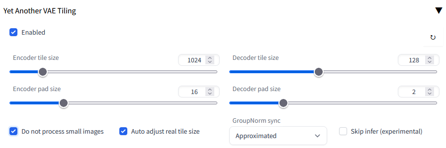

# stable-diffusion-webui-vae-tile-infer

    Yet another vae tiling inferer, extension script for AUTOMATIC1111/stable-diffusion-webui.

----

**VAE encoding / decoding is resource exhausting, often gets OOM (Out Of Memeory) errors or black images (NaNs).**
**You need this extension to draw large 2k/4k/8k images on low VRAM devices :)**

ℹ To draw really huge picture, you could use => [multidiffusion-upscaler-for-automatic1111](https://github.com/pkuliyi2015/multidiffusion-upscaler-for-automatic1111)
⚠ When processing with large images, please **turn off previews** to really save time and resoureces!!

⚠ 我们成立了插件反馈 QQ 群: 616795645 (赤狐屿)，欢迎出建议、意见、报告bug等 (w  
⚠ We have a QQ chat group (616795645) now, any suggestions, discussions and bug reports are highly wellllcome!!  




### Benchmark

```
GPU = NVIDIA GeForce RTX 3060 (VRAM 12G)
enc_tile_size = 1024
enc_tile_size = 16
dec_tile_size = 128
dec_tile_size = 2
auto_adjust   = True
zigzag_proc   = True
gn_sync       = Approx
skip_infer    = None
```

⚪ Encoding is cheap

| Image Size | original (fp16) | tile (fp16) |
| :-: | :-: | :-: |
|  512 x 512  | 0.009s /  2584.194MB | 0.314s / 2653.301MB |
|  768 x 768  | 0.011s /  3227.944MB | 0.425s / 3332.989MB |
| 1024 x 1024 | 0.012s /  4481.913MB | 0.516s / 4271.676MB |
| 1600 x 1600 | 0.031s /  8512.850MB | 1.746s / 4301.680MB |
| 2048 x 2048 | 0.034s / 10309.194MB | 2.575s / 4319.680MB |

⚪ Decoding is heavy

ℹ add `--no-half-vae` to your `COMMANDLINE_ARGS` to enable fp32 VAE infer ;)

| Image Size | original (fp16) | tile (fp16) | original (fp32) | tile (fp32) |
| :-: | :-: | :-: | :-: | :-: |
|  512 x 512  | 0.020s /  2616.033MB |  0.212s / 2685.320MB | 0.014s /  3135.253MB | 0.401s / 3323.200MB |
|  768 x 768  | 0.030s /  3296.306MB |  0.435s / 3399.634MB | 0.015s /  4255.566MB | 0.774s / 4583.594MB |
| 1024 x 768  | 0.024s /  3704.470MB |  0.619s / 3824.823MB | 0.019s /  4927.753MB | 1.094s / 5333.831MB |
| 1280 x 720  | 0.023s /  3985.083MB |  1.223s / 3404.754MB | 0.022s /  5389.882MB | 2.300s / 4592.075MB |
| 1024 x 1024 | 0.017s /  4248.689MB |  0.025s / 4248.689MB | 0.029s /  5824.003MB | 1.429s / 6324.145MB |
| 1920 x 1080 | 0.031s /  6375.797MB |  2.181s / 3812.524MB | 2.022s /  9328.607MB | 3.574s / 5406.281MB |
| 2048 x 1024 | 0.032s /  6425.564MB |  1.963s / 4665.738MB | 2.379s /  9409.003MB | 3.822s / 6336.069MB |
| 1600 x 1600 | 0.033s /  8373.138MB |  2.682s / 4387.482MB | 4.510s / 10991.445MB | 4.883s / 5985.629MB |
| 2048 x 1536 | 2.252s /  8602.439MB |  2.878s / 4460.361MB | 6.671s / 11456.003MB | 5.163s / 6603.190MB |
| 2560 x 1440 | 3.899s /  9725.989MB |  3.220s / 4353.073MB |       OOM            | 5.600s / 6455.756MB |
| 2048 x 2048 | 2.582s / 10265.877MB |  3.797s / 5225.127MB |       OOM            | 6.975s / 7998.725MB |
| 2560 x 4096 |       OOM            |  8.046s / 6648.868MB |       OOM            |        -            |
| 4096 x 4096 |       OOM            | 13.108s / 8585.713MB |       OOM            |       OOM           |
| 4096 x 8192 |       OOM            |        OOM           |       OOM            |       OOM           |


### How it works?

- split RGB image / latent image to overlapped tiles (they might not always be square)
- normally VAE encode / decode each tile, sync GroupNorm statistics by:
  - Approximate: using stats from the pre-computed low-resolution image
  - Full sync: using accurate stats to sync globally
  - No sync: do not sync
- concatenate all tiles back, the overlapped areas are **averaged** to avoid seams

⚪ settings tuning

- `Encoder/Decoder tile size`: image tile as the actual processing unit; larger value requires more real VRAM
- `Encoder/Decoder pad size`: overlapped padding of each tile; larger value making more seamless
- `Auto adjust real tile size`: auto shrink real tile size to match tensor shape, avoding too small tailing tile
- `Zigzag processing`: always keep at least one tile on GPU, will be faster but requires a bit more VRAM
- `GroupNorm sync`: how to sync GroupNorm stats
- `Skip infer (experimental)`: skip calculation of certain network blocks, faster but results low quality


The `max tensor size` in a process:

- for encode: `[B, 128, tile_size + 2 * pad_size, tile_size + 2 * pad_size]`
- for decode: `[B, 256, (latent_hight + 2 * pad_size) * 8, (latent_width + 2 * pad_size) * 8]`

is related to actual `max VRAM alloc`, and could be your reference to tune `tile_size`.


#### Acknowledgement

Thanks for the original idea from:

- multidiffusion-upscaler-for-automatic1111: [https://github.com/pkuliyi2015/multidiffusion-upscaler-for-automatic1111](https://github.com/pkuliyi2015/multidiffusion-upscaler-for-automatic1111)

----
by Armit
2023/01/20 
